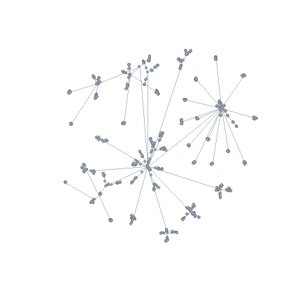
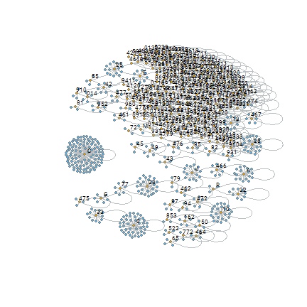
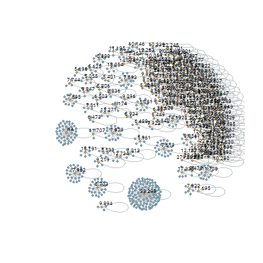
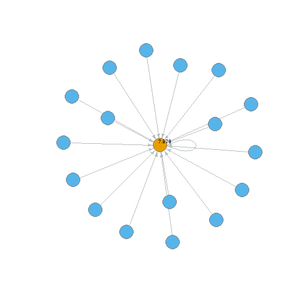

* [Introduction](#introduction)
    - [Example data](#example_data)
* [Creating a economic activity graph](#create_graph)
    - [Visualizing the hierarchy](#visualize)
* [Rolling up the hierarchy on values](#roll_up)


# <a name="introduction"></a>Introduction

Our company databases have codes that indicate a company's economic activity. Economic activities are indicated by the NACE, SBI or SIC codes, depending on the country. Although this classification in helpful when looking at a client's customer portfolio, it contains so many groups and in some cases so little customers per group, that it is hard to make a proper portfolio analysis to spot a clients opportunities. With this package you can make use of the hierarchical nature of the economic activity coding to make less and larger groups.


First let's load the package:

```r
library(graydon.package)
```

### <a name="example_data"></a>The example data

The package contains a data frame, _tbl_SBI_count_ which is an example of the SBI codes completed with a count of the Dutch companies associated with that SBI code. The data frame contains the following columns:

```r
data.frame(`Column names` = names(tbl_SBI_count)) %>% 
  knitr::kable()
```


|Column.names    |
|:---------------|
|code_SBI        |
|code_SBI_parent |
|description_SBI |
|hierarchy_layer |
|qty_companies   |

## <a name="create_graph"></a>Creating a economic activity graph

To do any calculation or plotting on the economic activity hierarchy, we have to create a graph. The parameters _col_id_ and _col_id_parent_ are the column names that contain the economic activity code and the parent code respectively.

```r
graph_SBI <- create_economic_activity_graph(tbl_SBI_count, 
                                            col_id = "code_SBI", 
                                            col_id_parent = "code_SBI_parent")
```

### <a name="visualize"></a>Visualizing the hierarchy

By visualizing the hierarchy with the package's _plot_graydon_graph_ function we can see it is very complex:

```r
plot_graydon_graph(graph_SBI, 
                   vertex.label = "", 
                   vertex.size = 3, 
                   edge.arrow.size = 0)
```



## <a name="roll_up"></a>Rolling up the hierarchy on values

A method for decreasing the complexity of the hierarchy is aggregating subcodes into higher up codes according whenever subnodes do not meet a minimum value requirement. Let's take the number of companies as an example: whenever the number of companies is lower than 5.000, the companies with that subcode will get the code of one higher up in the hierarchy:


```r
graph_SBI_rolled <- roll_up_hierarchy_by_minimum(graph_tree = graph_SBI,
                                                 name_attribute = "qty_companies",
                                                 name_propagated = "qty_companies_cum",
                                                 threshold = 5000)
```

Maybe it doesn't look as simple as you might want it to be, but it is a lot simpler than you'd think. The smaller networks you now see are the 'translation' networks: they specify which subcode should be recoded to which 'higher up' code. The highest code get's a loop back to itself. So each 'subnetwork' in this plot is actually one code in the newly acquired aggregation. The 'higher up' codes are marked as orange in this graph.


```r
V(graph_SBI_rolled)$color <- ifelse(V(graph_SBI_rolled)$is_root, 1, 2)
V(graph_SBI_rolled)$label <- ifelse(V(graph_SBI_rolled)$is_root, V(graph_SBI_rolled)$name, "")

plot_graydon_graph(graph_SBI_rolled,
                   vertex.size = 3,
                   edge.arrow.size = 0)
```



```r
V(graph_SBI_rolled)$label <- format_number(V(graph_SBI_rolled)$qty_companies_cum)
V(graph_SBI_rolled)$label <- ifelse(V(graph_SBI_rolled)$label == 0, "", V(graph_SBI_rolled)$label)

plot_graydon_graph(graph_SBI_rolled,
                   vertex.size = 3,
                   edge.arrow.size = 0)
```



We could isolate these clusters and inspect them further if we wanted to:

```r
list_graphs <- decompose(graph_SBI_rolled)

# Getting all ending activity codes
idx_searched <- names(sapply(list_graphs, function(x) igraph::V(x)[1] ))

plot_graydon_graph(list_graphs[[1]])
```



This graph is the basis of translating the original economic activity 

```r
df_translation_codes <- rolled_up_as_data_frame(graph_SBI_rolled)
```

|code |code_parent |description_SBI                                                     | hierarchy_layer| qty_companies| dist_to_root| qty_companies_cum|is_root | color|label  |
|:----|:-----------|:-------------------------------------------------------------------|---------------:|-------------:|------------:|-----------------:|:-------|-----:|:------|
|A    |A           |Landbouw, bosbouw en visserij                                       |               1|             0|            1|              7879|TRUE    |     1|7.879  |
|C    |C           |Industrie                                                           |               1|             0|            1|             33298|TRUE    |     1|33.298 |
|10   |10          |Vervaardiging van voedingsmiddelen                                  |               2|             0|            2|              7962|TRUE    |     1|7.962  |
|13   |13          |Vervaardiging van textiel                                           |               2|             0|            2|              5281|TRUE    |     1|5.281  |
|23   |23          |Vervaardiging van overige niet-metaalhoudende minerale producten    |               2|             0|            2|              5703|TRUE    |     1|5.703  |
|25   |25          |Vervaardiging van producten van metaal (geen machines en apparaten) |               2|             0|            2|              7693|TRUE    |     1|7.693  |

